# Temas do windows terminal

Trata-se de temas de cores de fundo e das letras do terminal Windows Terminal disponível no Microsoft Store

## Instruções de Instalação

### 1) Abra o Windows Terminal e clique na flecha para baixo

### 2) Em seguida clique em configurações

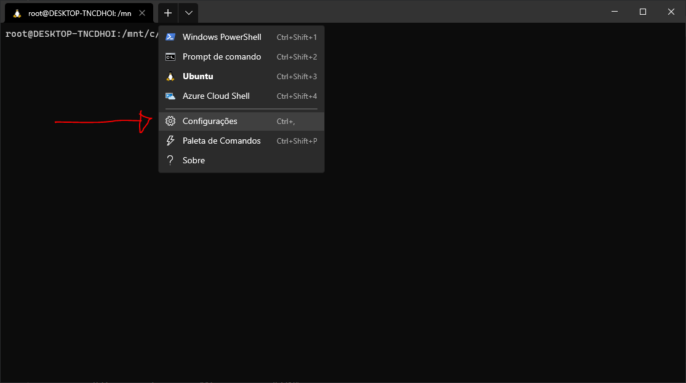

### 3) Depois vá até a opção "Abrir o arquivo JSON"

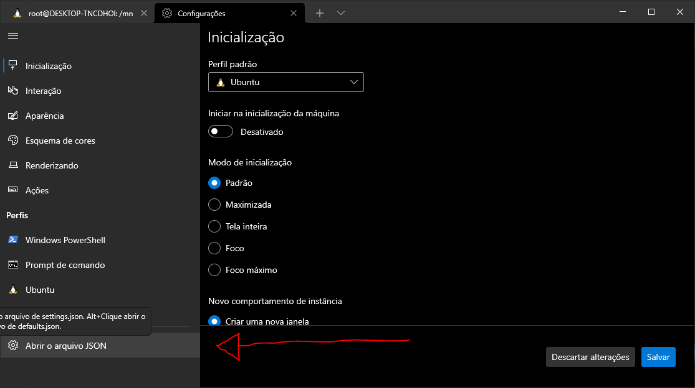

### 4) Logo, será aberto automaticamente um editor padrão qualquer. Como por exemplo Vs Code, Microsoft Visual Studio, Átomo, sublime_text, bloco de notas e etc...

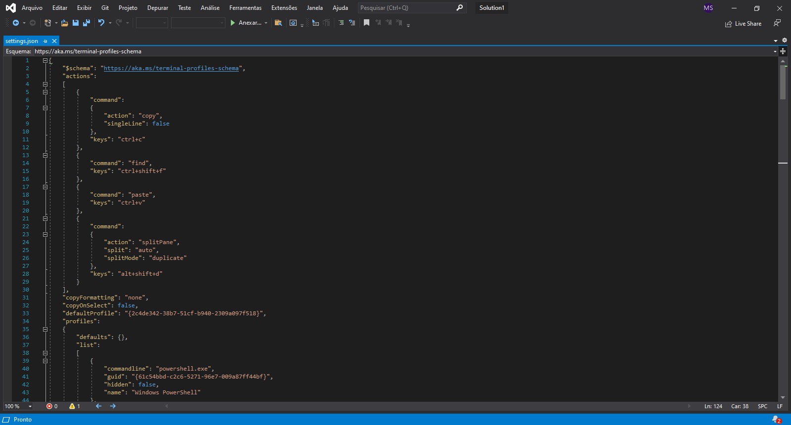

### 5) Logo após abrir um desses editor. No arquivo JSON aberto, procure pela seção "schemes":

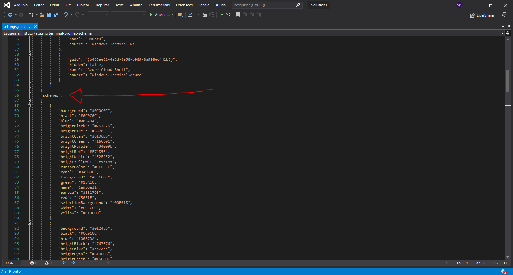

### 6) Logo em seguida haverá um colchetes em aberto

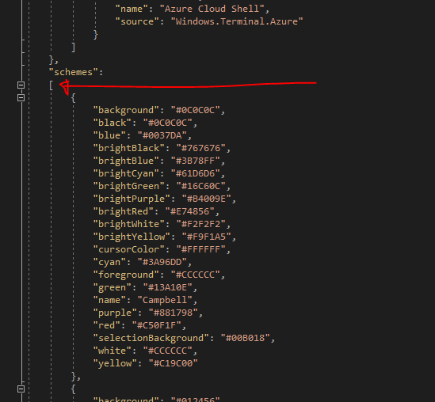

### 7) Depois você dê um enter logo depois desse colchete, o que fará você descer uma linha nova abaixo

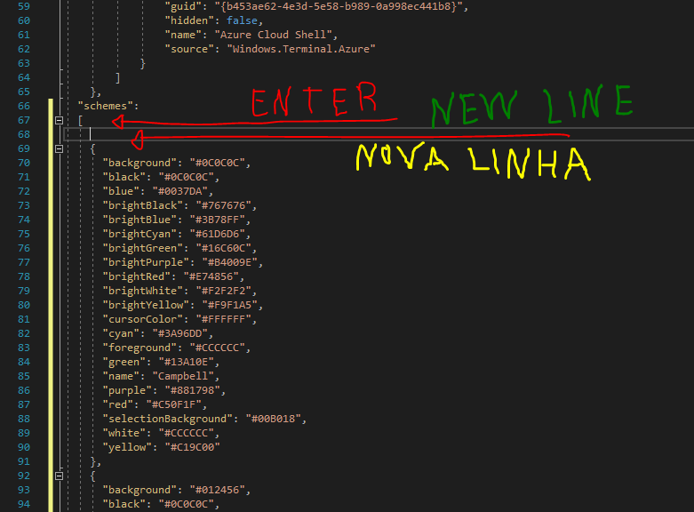

### 8) Então depois você vá até o arquivo "dark_green.json" e abra-o

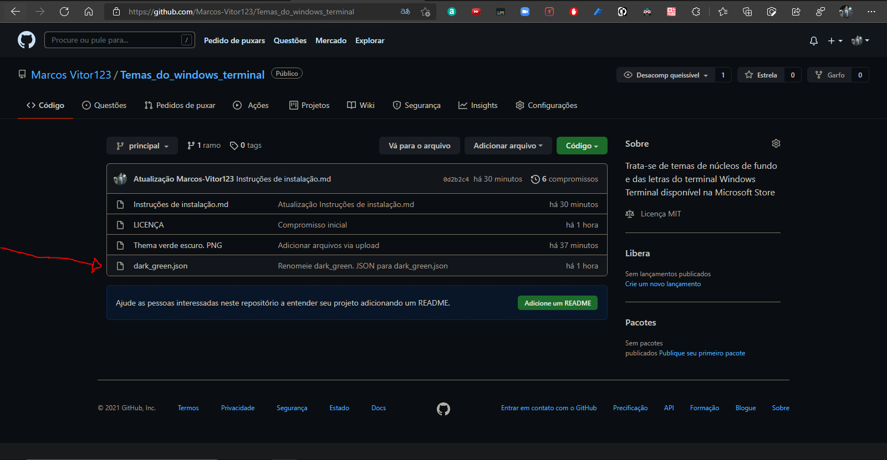

### 9) E Selecione todo esse código e copie

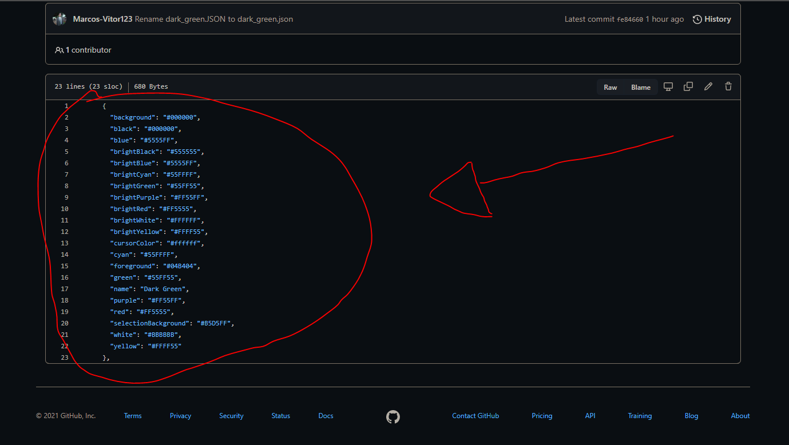

### 10) E depois cole esse código nessa linha nova e salve o arquivo clicando nas teclas "ctrl + s"

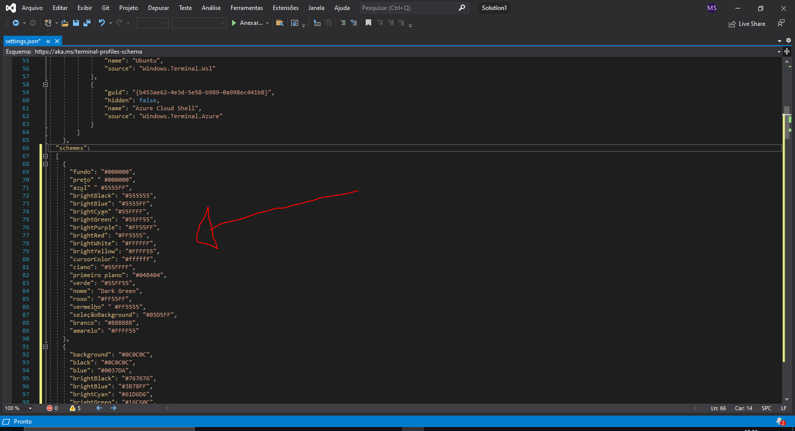

### 11) Logo após isso dê um clique na fleca para baixo do Windows Terminal novamente e vá até configurações

### 12) Em seguida vá até a opção Perfis e selecione o seu editor Windows, PowerShell ou a sua distribuição linux que você usa

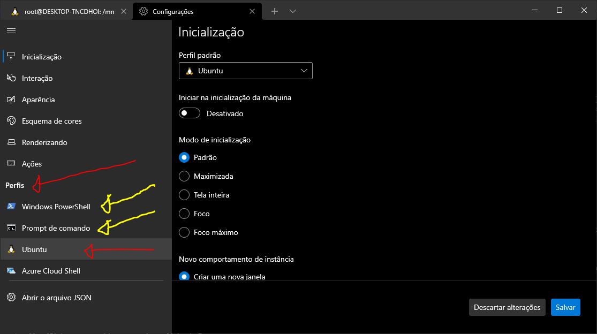

### 13) Logo depois clique na opção "Aparência"

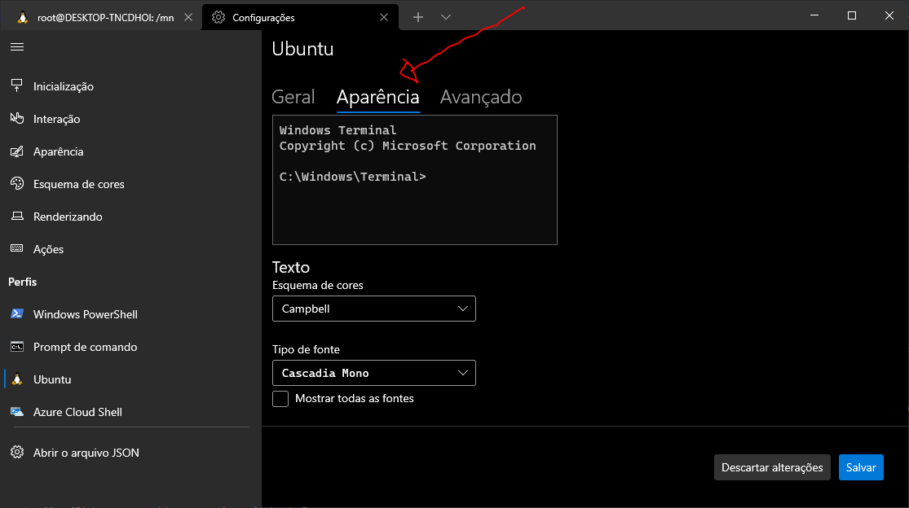

### 14) Depois vá até o campo chamado de "Esquema de cores" e dê um clique

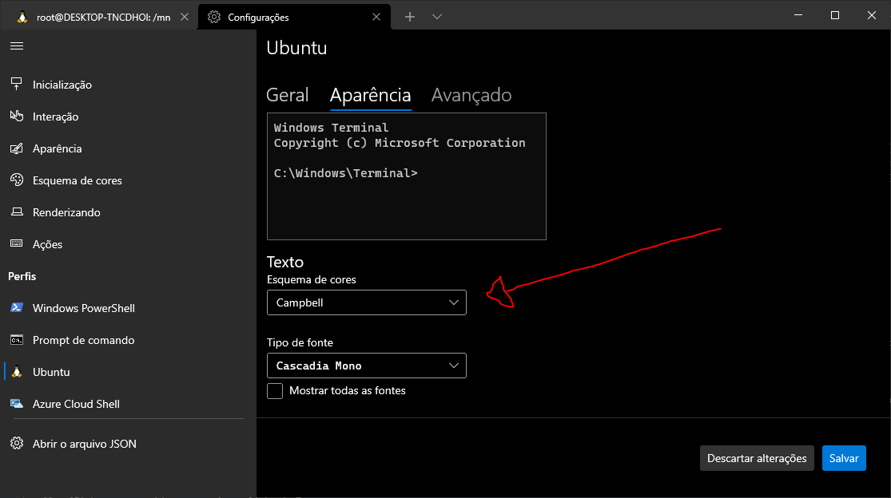

### 15) Logo em seguida aparecerá uma lista de Temas

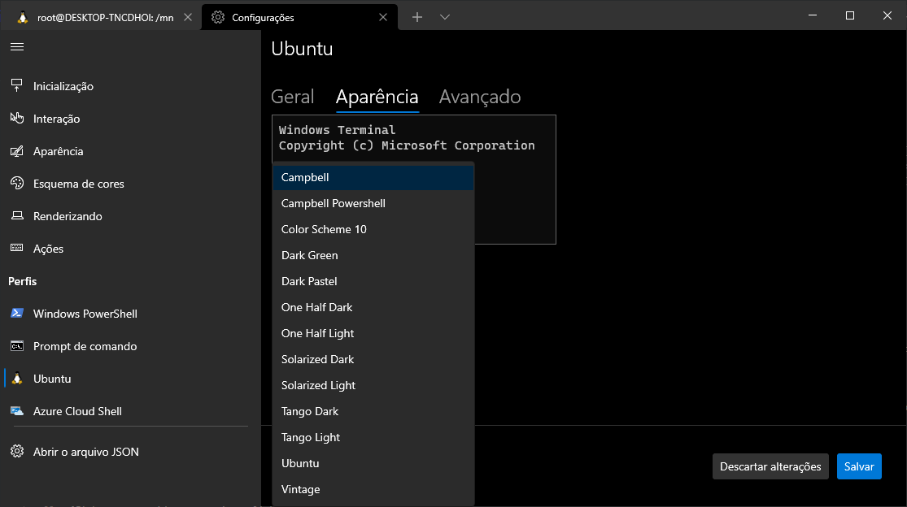

### 16) Aí você procura o Tema com o nome "Dark Green" e selecione-o

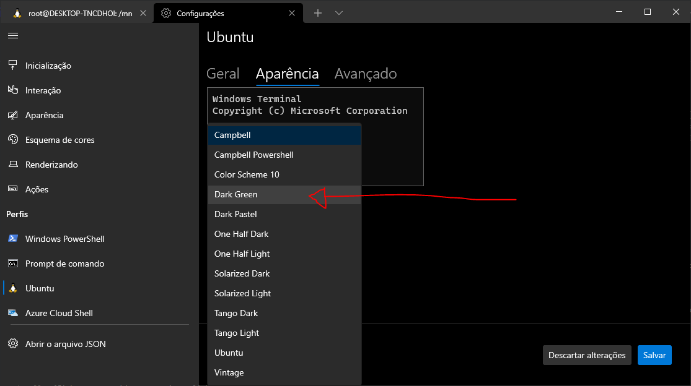

### 17) Depois clique no botão "Salvar" no canto inferior direito

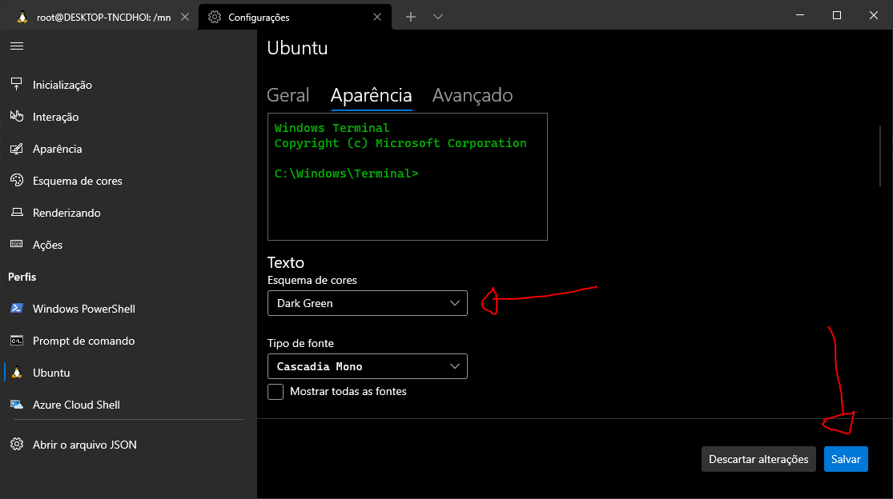

### 18) E depois feche o editor e as configurações. E o tema estará funcionando, como na imagem abaixo:

